# TP1 DPBO

# Janji
Saya <strong>Muhamad Hasbie Assyattar</strong> dengan <strong>NIM 2508288</strong> mengerjakan Tugas Praktikum 1 dalam mata kuliah Desain dan Pemrograman Berorientasi Objek untuk keberkahanNya maka saya tidak melakukan kecurangan seperti yang telah dispesifikasikan. Aamiin.

# Penjelasan 
- CekId = Mengecek apakah id sudah ada atau belum
- tambahTiket = Menambahkan data tiket
- updateTiket = Mengupdate data tiket
- hapusTiket = Menghapus data tiket
- cariTiket = Mencari data tiket
- tampilSemua = Menampilkan semua data tiket
- menuTiket = Menampilkan menu

# Dokumentasi Output

## CPP
### Tampilan Menu
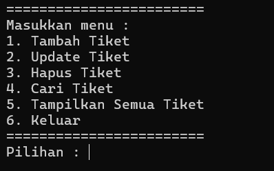

### Tambah Tiket
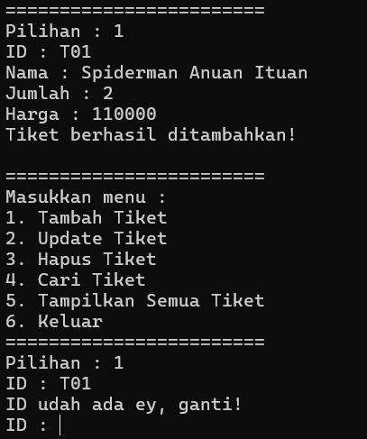

### Update Tiket
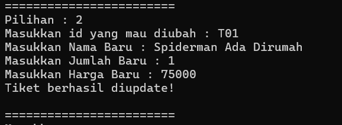

### Hapus Tiket
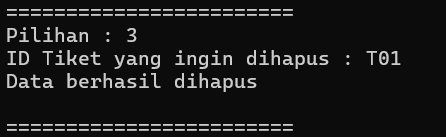

### Cari Tiket
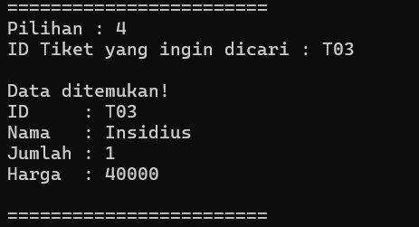

### Tampilkan Semua Tiket
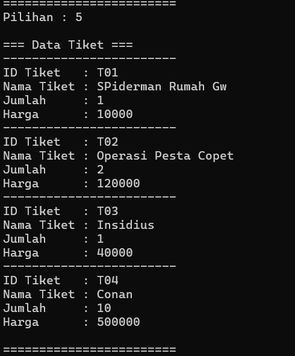

## Java
### Tampilan Menu
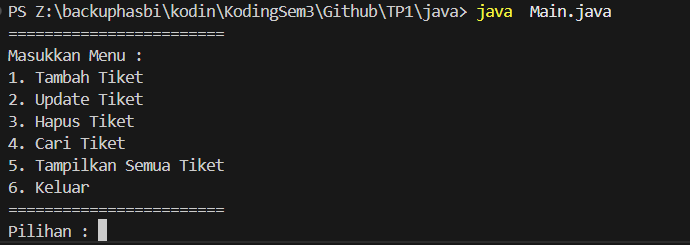

### Tambah Tiket
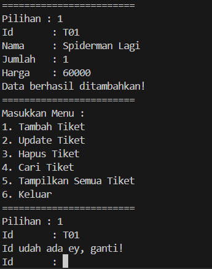

### Update Tiket
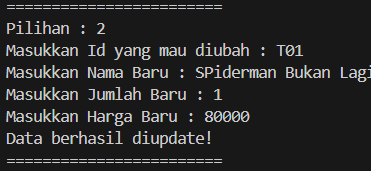

### Hapus Tiket
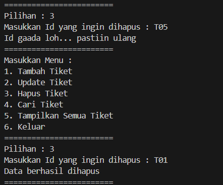

### Cari Tiket
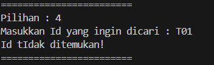

### Tampilkan Semua Tiket
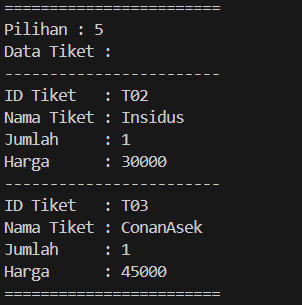

## Python
### Tampilan Menu
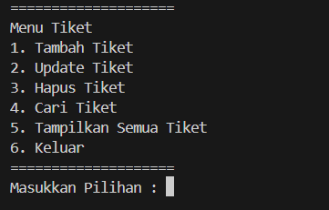

### Tambah Tiket
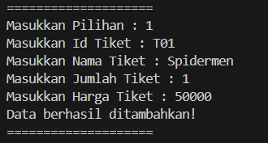

### Update Tiket
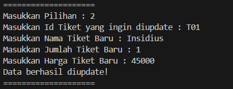

### Hapus Tiket
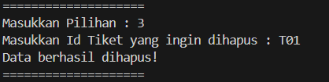

### Cari Tiket
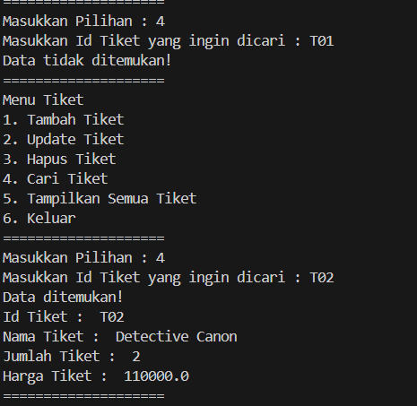

### Tampilkan Semua Tiket
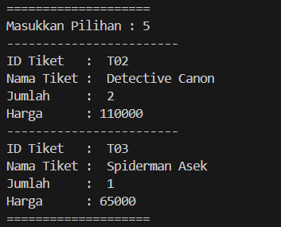

## PHP
### Tambah Tiket
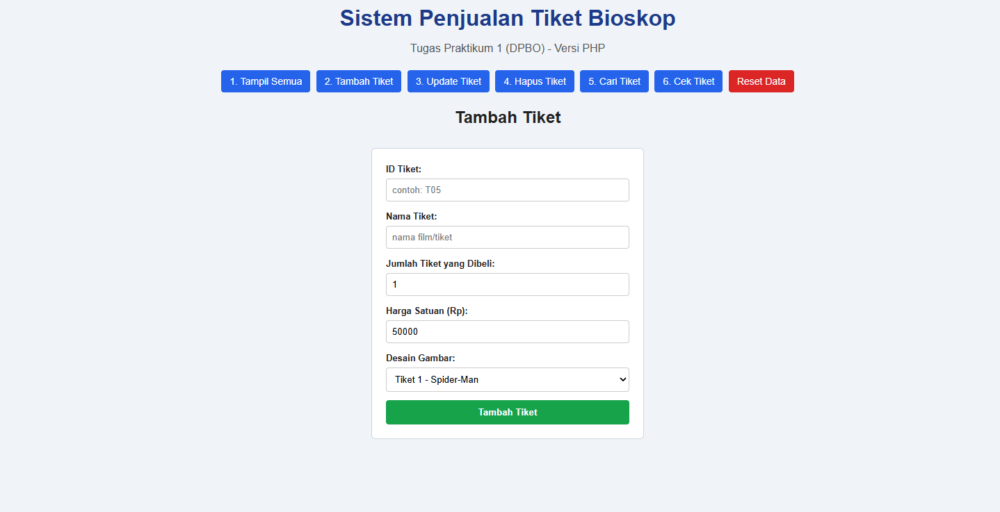

### Update Tiket
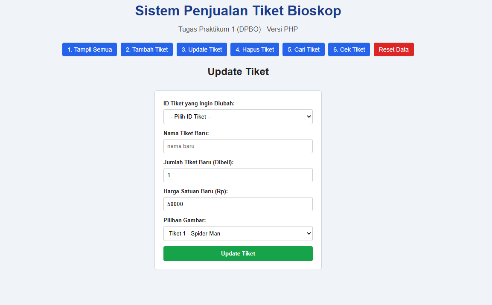

### Hapus Tiket
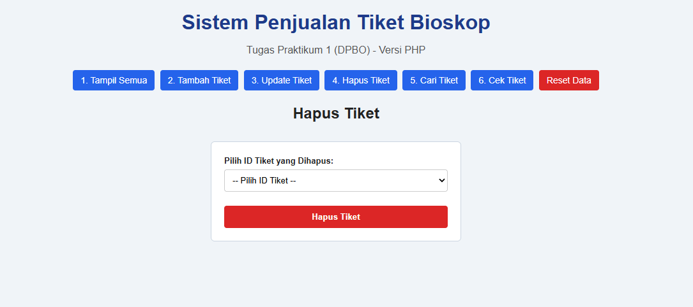

### Cari Tiket
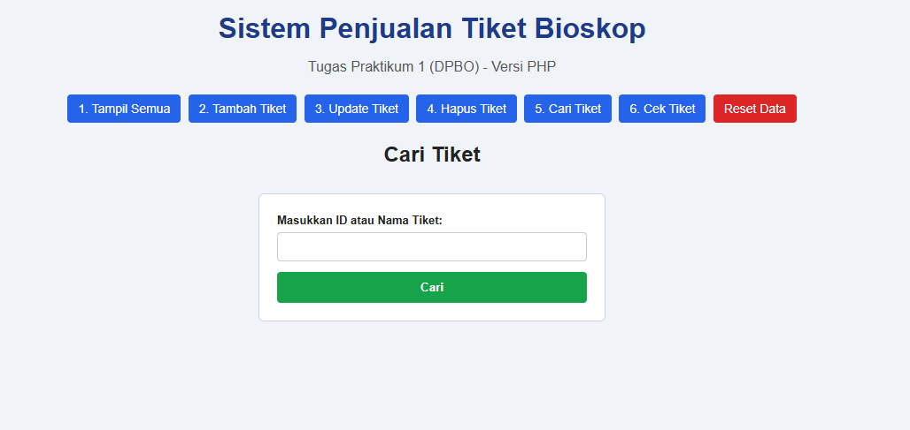

### Cek Id
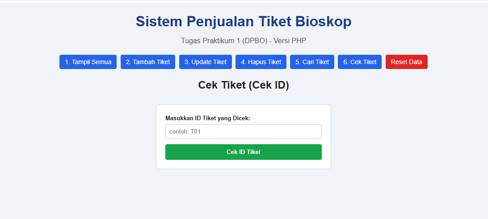

### Tampilkan Semua Tiket
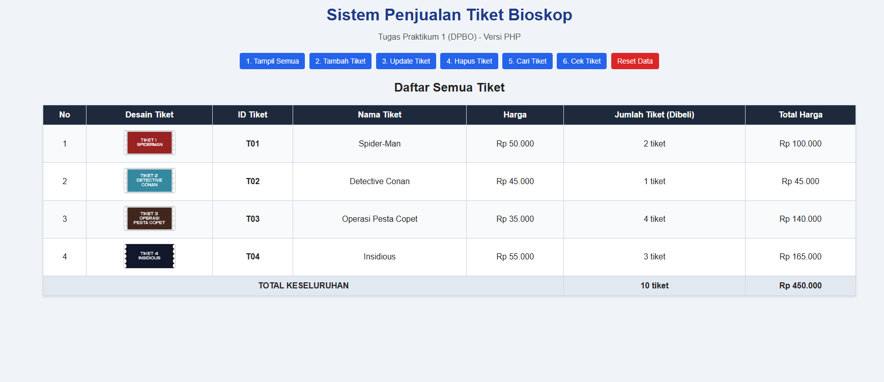
